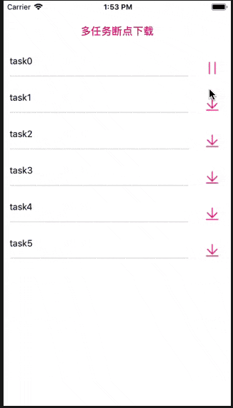

# SCDownloader
基于AFN3.2.1，实现多任务断点下载功能。

## 效果图



## 特点

- 实现暂停后继续下载

- 可以同时下载多个资源

- 实现退入后台继续下载

- 实现杀掉APP进程保留下载进度


## 代码说明

1. 获取网络数据，创建用于下载资源的模型

```
typedef NS_ENUM(NSInteger, SCDownloadStatus) {
    //暂停或者未开始状态
    SCDownloadStatusSuspend,
    //继续或者正在下载状态
    SCDownloadStatusResume,
    //完成状态
    SCDownloadStatusFinished
};

NS_ASSUME_NONNULL_BEGIN

@interface SCDataModel : NSObject

/**
 请求资源的额URL，这里也作为唯一标识符使用
 */
@property (nonatomic, copy) NSString *videoUrl;

/**
 下载状态
 */
@property (nonatomic, assign) SCDownloadStatus status;

/**
 下载进度
 */
@property (nonatomic, copy) NSString *progress;

/**
 下载数据
 */
@property (nonatomic, strong) NSData *resumeData;

@end

NS_ASSUME_NONNULL_END
```

创建这个模型是为了杀掉APP后仍然能恢复状态

2. SCDownloadHelper.h文件，实现主要下载功能

```
@interface SCDownloadHelper ()
/**
 是AFURLSessionManager的子类，为HTTP的一些请求提供了便利方法，当提供baseURL时，请求只需要给出请求的路径即可
 */
@property (nonatomic, strong) AFHTTPSessionManager *requestManager;
/**
 下载历史记录 key:URL value:dataModel ps:key只要是惟一的标识符就好
 */
@property (nonatomic,strong) NSMutableDictionary *downLoadHistoryDictionary;

/**
 保存任务的task和模型 key:URL value:@{@"":@""} ps:key只要是惟一的标识符就好
 */
@property (nonatomic, strong) NSMutableDictionary *downlaodTaskDictionary;

@end

```

downlaodTaskDictionary这个字典是为了每个下载资源都对应一个下载任务，和一个下载模型，任务之间互不干涉，实现多任务同时下载。downLoadHistoryDictionary这个字典用于保存数据模型到本地，实现断点下载，杀掉进程恢复任务的功能。

3. 下载和暂停实现 

```
- (void)downloadWithRequestModel:(id)requestModel
                   fileDirectory:(NSString *)fileDirectory
                        progress:(SCHttpProgress)progress
                         success:(SCHttpRequestSuccess)success
                         failure:(SCHttpRequestFailed)failure;
{
    SCDataModel *model = (SCDataModel *)requestModel;
    
    NSURLRequest *request = [NSURLRequest requestWithURL:[NSURL URLWithString:model.videoUrl]];
    
    NSData *downLoadHistoryData = [self getResumeDataWithKey:model.videoUrl];
    
    NSURLSessionDownloadTask *downloadTask = [[self.downlaodTaskDictionary objectForKey:model.videoUrl] objectForKey:kTask];
    
    if (downLoadHistoryData.length > 0) {
        downloadTask = [self.requestManager downloadTaskWithResumeData:downLoadHistoryData progress:^(NSProgress * _Nonnull downloadProgress) {
            
            progress(downloadProgress);
            
        } destination:^NSURL * _Nonnull(NSURL * _Nonnull targetPath, NSURLResponse * _Nonnull response) {
            //拼接缓存目录
            NSString *downloadDir = [[NSSearchPathForDirectoriesInDomains(NSCachesDirectory, NSUserDomainMask, YES) lastObject] stringByAppendingPathComponent:fileDirectory ? fileDirectory : @"Download"];
            //打开文件管理器
            NSFileManager *fileManager = [NSFileManager defaultManager];
            //创建Download目录
            [fileManager createDirectoryAtPath:downloadDir withIntermediateDirectories:YES attributes:nil error:nil];
            //拼接文件路径
            NSString *filePath = [downloadDir stringByAppendingPathComponent:model.videoUrl];
            //返回文件位置的URL路径
            return [NSURL fileURLWithPath:filePath];
            
        } completionHandler:^(NSURLResponse * _Nonnull response, NSURL * _Nullable filePath, NSError * _Nullable error) {
            if (error) {
                failure(error);
            }else{
                success([filePath path]);
            }
        }];
        
    }else{
        downloadTask = [self.requestManager downloadTaskWithRequest:request progress:^(NSProgress * _Nonnull downloadProgress) {

            progress(downloadProgress);
            
        } destination:^NSURL * _Nonnull(NSURL * _Nonnull targetPath, NSURLResponse * _Nonnull response) {
            
            //拼接缓存目录
            NSString *downloadDir = [[NSSearchPathForDirectoriesInDomains(NSCachesDirectory, NSUserDomainMask, YES) lastObject] stringByAppendingPathComponent:fileDirectory ? fileDirectory : @"Download"];
            //打开文件管理器
            NSFileManager *fileManager = [NSFileManager defaultManager];
            //创建Download目录
            [fileManager createDirectoryAtPath:downloadDir withIntermediateDirectories:YES attributes:nil error:nil];
            //拼接文件路径
            NSString *filePath = [downloadDir stringByAppendingPathComponent:model.videoUrl];
            //返回文件位置的URL路径
            return [NSURL fileURLWithPath:filePath];
            
        } completionHandler:^(NSURLResponse * _Nonnull response, NSURL * _Nullable filePath, NSError * _Nullable error) {
            if (error) {
                failure(error);
            }else{
                success([filePath path]);
            }
        }];
    }
    
    [self.downlaodTaskDictionary setObject:@{kTask: downloadTask, kModel: model} forKey:model.videoUrl];
    [downloadTask resume];
}

- (void)suspendWithURLString:(NSString *)URLString
{
    NSURLSessionDownloadTask *downloadTask = [[self.downlaodTaskDictionary objectForKey:URLString] objectForKey:kTask];
    
    [downloadTask cancelByProducingResumeData:^(NSData * _Nullable resumeData) {
        
    }];
}
```

判断是否有downLoadHistoryData，如果有走`downloadTaskWithResumeData:`方法，没有的话走`downloadTaskWithRequest:`方法

4. AFN一个重要的通知`AFNetworkingTaskDidCompleteNotification`,监听下载完成的情况，暂停，下载完成都会发出这个通知。

```

#pragma mark == Notification
- (void)downLoadData:(NSNotification *)notification{
    
    if ([notification.object isKindOfClass:[ NSURLSessionDownloadTask class]]) {
        NSURLSessionDownloadTask *task = notification.object;
        NSString *urlHost = [task.currentRequest.URL absoluteString];
        NSError *error  = [notification.userInfo objectForKey:AFNetworkingTaskDidCompleteErrorKey] ;
        if (error) {
            if (error.code == -1001) {
                NSLog(@"下载出错,看一下网络是否正常");
            }
            NSData *resumeData = [error.userInfo objectForKey:@"NSURLSessionDownloadTaskResumeData"];
            [self saveLocalWithKey:urlHost DownloadTaskResumeData:resumeData];
            //这个是因为 用户比如强退程序之后 ,再次进来的时候 存进去这个继续的data  需要用户去刷新列表
        }
    }
}
```


## 联系

Email：[15756377633@163.com](mailto:15756377633@163.com)

Wechat：v268743

## License

The SCDownloader project is available for free use, as described by the LICENSE (Apache 2.0).
